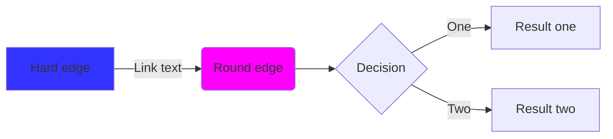

# 映射（Mapping）

映射是一种加速查找的索引方式。他有具体的语义或者时间发展顺序。

## 实例（case）

```rs
#! (ink pub (T i) (attr (type Mapping:Case) (p (list D R))))
```

- 实现：实例， `(type Case)` ，语义概念与实例的映射。语义概念的不断发展。

### 标题：水的升华（元素-实例）

> 实例需要引用cite [元素]嘛？或许不需要把，因为程序在正常运行期已经包含所有依赖项。所以不需要cite。cite仅在多态、基本、组合中使用。


## 列表

```rs
#! (ink pub (T i) (attr (type Mapping:List) (p (list D R))))
```

优先级列表、难度列表、时间列表。有序列表。角度也许是从这些有序或者无序集合中说的。


## Graph

```rs
#! (ink pub (T i) (attr (type Mapping:Graph) (p (list D R))))
```




## Moc

```rs
#! (ink pub (T i) (attr (type Mapping:Moc) (p (list D R))))
```

### MOC Mermiad

- Mermaid 概述
  - 什么是 Mermaid？
  - Obsidian 中的 Mermaid
  - Mermaid 注释
- 图表类型
  - 流图

LINKS TO THIS PAGE