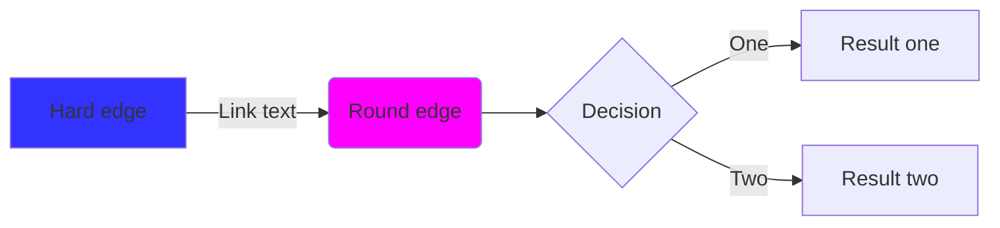

# 映射（Mapping）

映射是一种加速查找的索引方式。他有具体的语义或者时间发展顺序。

## 实例（case）

```rs
#! (ink pub (attr (type Map+Case) (p [D R])))
```

```yaml
ink.type: Map+Case
```

- 实现：实例， `(type Case)` ，语义概念与实例的映射。语义概念的不断发展。

### 标题：水的升华（元素-实例）

> 实例需要引用cite [元素]嘛？或许不需要把，因为程序在正常运行期已经包含所有依赖项。所以不需要cite。cite仅在多态、基本、组合中使用。


## 列表 = 序列 = 清单 = 有序集合

<!-- 把时间当作朋友 -->

```rs
#! (ink pub (attr (type Map+List) (p {D R})))
```

```yaml
ink.attr.type: Map+List
```
优先级列表、难度列表、时间列表。有序列表。角度也许是从这些有序或者无序集合中说的。

任务清单、项目清单

项目、领域

unique to-do list唯一代办优先级列表

## 重定向
```yaml
ink.attr.type: Map+Redirect
```

Wikipedia 的重定向功能本质上是一种特殊的页面管理机制，其主要目的是为了确保用户在访问具有多个名称或变体的相同主题时，能够被引导至正确的、统一的条目页面。

### 术语

```rs
#! (ink pub (attr (type Term+[areas]) (p [D R])))
```

术语使得概念变得简单而不混淆，通用。指定语词的哪一个具体含义。如果对某个词赋予太多意义就很容易使沟通变得困难且难以理解

term 和word 同一个词有不同的解释。属于我确实需要一类边表明它自己的身份多词汇的描述，先把词汇当成语言符号，然后在放到具体语境中。另外多学科使用同一词汇，但文件名只能有一个该如何处理？

使用term标注具体领域（Specific areas），引用时表明领域和term，对于普通word，直接使用word即可。

一个事物的确有多个类别、多方面的解释，比如某个词汇的多学科概念内涵。如何在一个描述中涵盖这些东西？

#### 一词多义

一词多义是指一个单词蕴含不同的含义。可能的情况有：

英文缩写：MOC可能是知识管理中的Maps of content，也可能是乐高拼图中的My Own Creation.
多个著名人物的名字相同：例如乔丹可能指美国的运动员，也可能是葡萄牙运动员，甚至是一家体育用品的企业。
在传统的维基（wiki）系统中，会使用一个义项页面来解决这问题，但目前obsidian和RoamResearch好像都没有很好的解决方法。


有些词语，只有在特定领域才有意义，当然其他领域也会有这个词，那么这个词也只有这个领域才能有意义。

## Graph

索引的两种形式 Graph、Moc：要有实际的图，可以看见的的图，也要有承载内容的点，以及点上的边。mermaid，graphviz

```rs
#! (ink pub (attr (type Map+Graph) (p [D R])))
```

```yaml
ink.attr.type: Map+Graph
```




## Moc

```rs
#! (ink pub (attr (type Map+Moc) (p {D R})))
```

```yaml
ink.attr.type: Map+Moc
```

在 MOC（内容地图）中按邻近性进行组织。

问：MOC 与 TOC（目录）相比如何？

答：MOC 是流动的，而 TOC 是刚性的。这是设计使然。目录用于组装特定的线性顺序。MOC 的用途要广泛得多。通常，当项目开始完成时，MOC 可能会演变成 TOC。
### MOC Mermiad

- Mermaid 概述
  - 什么是 Mermaid？
  - Obsidian 中的 Mermaid
  - Mermaid 注释
- 图表类型
  - 流图

LINKS TO THIS PAGE