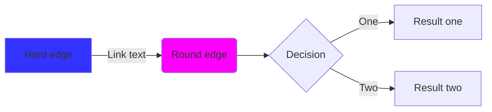

# 映射（Mapping）

映射是一种加速查找的索引方式。他有具体的语义或者时间发展顺序。

## Moc

```rs
#! (ink pub (attr (type Map+Moc) (p {D R})))
```

```yaml
ink-type: Map+Moc
```

MOC 索引

在 MOC（内容地图）中按邻近性进行组织。

问：MOC 与 TOC（目录）相比如何？

答：MOC 是流动的，而 TOC 是刚性的。这是设计使然。目录用于组装特定的线性顺序。MOC 的用途要广泛得多。通常，当项目开始完成时，MOC 可能会演变成 TOC。

### Topic

```yaml
ink-type: map+moc+topic
```

- 主题索引卡 topic
  - 单独成卡。主题索引卡是完整而详细的，通常是一本书的目录或者是一篇文章的大纲
  - 一种项目卡
  - Zotero 的**动态文件夹**功能
  - 当一个主题发展到需要概述的程度时，通过收集所有与这个主题相关的内容，用简短的话说明笔记上是什么内容，用一张新的卡片，对主题进行概述，这就是主题索引。这种笔记有助于组织思路，构建项目框架，梳理内容的层次结构，也可以用来构建项目的初稿。整体看来，主题索引更像书籍的目录和概述部分，==将分散的内容关联起来，在结构上划分层次，聚合成一个更大的元素==。

## 列表

= 序列 = 清单 = 有序集合

%% 把时间当作朋友 %%

```rs
#! (ink pub (attr (type Map+List) (p {D R})))
```

```yaml
ink-type: Map+List
```

优先级列表、难度列表、时间列表。有序列表。角度也许是从这些有序或者无序集合中说的。

任务清单、项目清单

项目、领域

Unique to-do list 唯一代办优先级列表

### Keyword

```yaml
ink-type: Map+List+Word
```

- 关键词表 Keyword List
  - 一个固定顺序的系统。
  - 关键词表常常只列出一个关键词在整个系统里几个不同的位置。
  - Rhetorik：21/3 a 1 p 5,1、21/3 a 1 pe 9 pa、7/25 g 17 d 7、7/9 d。
- 关键词索引卡 Word
  - 此索引没有形成完整清晰的大纲，只是相关话题或者内容就会整理到一起
  - 关键词索引是一个纯粹的入口列表，每个关键词后面有一个或几个 ID，入口 ID 所标识的笔记一定是与关键字最紧密相关的。当你找到了入口，就能通过笔记之间互相引用的关系，发现一个更加广阔的知识体系，就像上网时从一个网页跳到另一个网页，有了入口，你就可以在笔记中冲浪了。卢曼的笔记系统中，用索引卡片来连接所有笔记是不现实的，也没必要，==关键词的索引目的，只是为了快速找到笔记的位置而已==。
  - 例子：关键词 ID; ID; ID
  - 关键词可以使用首字母进行排序。

## 实例（case）

```rs
#! (ink pub (attr (type Map+Case) (p [D R])))
```

```yaml
ink-type: Map+Case
```

- 实现：实例， `(type Case)` ，语义概念与实例的映射。语义概念的不断发展。

### 标题：水的升华（元素-实例）

> 实例需要引用 cite [元素]嘛？或许不需要把，因为程序在正常运行期已经包含所有依赖项。所以不需要 cite。cite 仅在多态、基本、组合中使用。

## 重定向

```yaml
ink-type: Map+Redirect
```

Wikipedia 的重定向功能本质上是一种特殊的页面管理机制，其主要目的是为了确保用户在访问具有多个名称或变体的相同主题时，能够被引导至正确的、统一的条目页面。

### 术语

```rs
#! (ink pub (attr (type Term+[areas]) (p [D R])))
```

术语使得概念变得简单而不混淆，通用。指定语词的哪一个具体含义。如果对某个词赋予太多意义就很容易使沟通变得困难且难以理解

term 和 word 同一个词有不同的解释。属于我确实需要一类边表明它自己的身份多词汇的描述，先把词汇当成语言符号，然后在放到具体语境中。另外多学科使用同一词汇，但文件名只能有一个该如何处理？

使用 term 标注具体领域（Specific areas），引用时表明领域和 term，对于普通 word，直接使用 word 即可。

一个事物的确有多个类别、多方面的解释，比如某个词汇的多学科概念内涵。如何在一个描述中涵盖这些东西？

### 一词多义

一词多义是指一个单词蕴含不同的含义。可能的情况有：

英文缩写：MOC 可能是知识管理中的 Maps of content，也可能是乐高拼图中的 My Own Creation.
多个著名人物的名字相同：例如乔丹可能指美国的运动员，也可能是葡萄牙运动员，甚至是一家体育用品的企业。
在传统的维基（wiki）系统中，会使用一个义项页面来解决这问题，但目前 obsidian 和 RoamResearch 好像都没有很好的解决方法。

有些词语，只有在特定领域才有意义，当然其他领域也会有这个词，那么这个词也只有这个领域才能有意义。

## Graph

索引的两种形式 Graph、Moc：要有实际的图，可以看见的的图，也要有承载内容的点，以及点上的边。mermaid，graphviz

```rs
#! (ink pub (attr (type Map+Graph) (p [D R])))
```

```yaml
ink-type: Map+Graph
```



- Mermaid 概述
  - 什么是 Mermaid？
  - Obsidian 中的 Mermaid
  - Mermaid 注释
- 图表类型
  - 流图

LINKS TO THIS PAGE

## Rel

```yaml
ink-type: map+rel+link
ink-type: map+rel+diff
ink-type: map+rel+inf
ink-type: map+rel+appl
```
